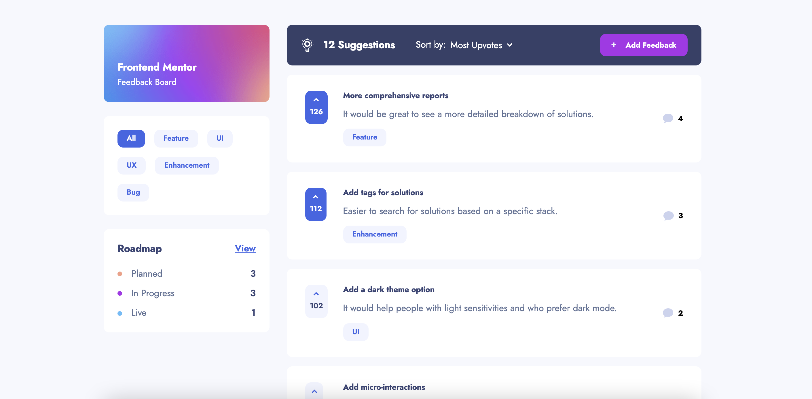

# Frontend Mentor - Product feedback app solution

This is a solution to the [Product feedback app challenge on Frontend Mentor](https://www.frontendmentor.io/challenges/product-feedback-app-wbvUYqjR6). Frontend Mentor challenges help you improve your coding skills by building realistic projects.

## Table of contents

- [Overview](#overview)
  - [The challenge](#the-challenge)
  - [Screenshot](#screenshot)
  - [Links](#links)
- [My process](#my-process)
  - [Built with](#built-with)
  - [What I learned](#what-i-learned)
- [Author](#author)

## Overview

### The challenge

Users should be able to:

- View the optimal layout for the app depending on their device's screen size
- See hover states for all interactive elements on the page
- Create, read, update, and delete product feedback requests
- Receive form validations when trying to create/edit feedback requests
- Sort suggestions by most/least upvotes and most/least comments
- Filter suggestions by category
- Add comments and replies to a product feedback request
- Upvote product feedback requests
- **Bonus**: Keep track of any changes, even after refreshing the browser (`localStorage` could be used for this if you're not building out a full-stack app)

### Screenshot

### Links

- Live Site URL: [Link](https://product-feedback-next.vercel.app/)

## My process

### Built with

- Semantic HTML5 markup
- CSS custom properties
- Flexbox
- CSS Grid
- Mobile-first workflow
- [React](https://reactjs.org/) - JS library
- [Next.js](https://nextjs.org/) - React framework
- [Styled Components](https://styled-components.com/) - For styles
- GraphQL
- Apollo Client
- Keystone.js v5
- MongoDB

### What I learned

There were a lot of firsts for me in this project. I really wanted to push my comfort zone in terms of testing out new tech. It was my first time using a headless CMS, Next.js, and GraphQL/Apollo Client. There was a lot of tinkering and testing out best practices for the needs of the project.

**What I liked**:
I liked using the GraphQL APIs mostly because of how simple the syntax was and how much control you have over what data comes back from the API. I also really liked using Next.js. The simplified routing and image handling made things super easy. I also liked the flexibility to generate static and server side props depending on your needs. Next.js will be my go-to tech moving forward.

**What I didn't like**:
I'm not sure if it was because Keystone.js v6 didn't have support for MongoDB yet but I didn't like working with Keystone. I had to use v5 because I wanted to use MongoDB and the documentation wasn't always the easiest to follow/implement. I relied more on Googling to solve problems vs. using the documentation. In the future, when I need a headless CMS, I will be looking into other options.

Overall, I feel that I have gained a significant understanding into a ton of new tech and have a better understanding for the pros and cons of each. I also increased my problem solving and research abilities due to having to rely on documentation and Googling to solve problems within the scope of all of this new tech. I couldn't rely on my previous experience and notes from using tech that I was comfortable with.

## Author

- [Website](https://www.jeffjakinovich.com/)
- Frontend Mentor - [@jljakin2](https://www.frontendmentor.io/profile/jljakin2)
- Twitter - [@jjak13](https://twitter.com/jjak13)
- Hashnode - [@jjak13](https://hashnode.com/@jjak13)
